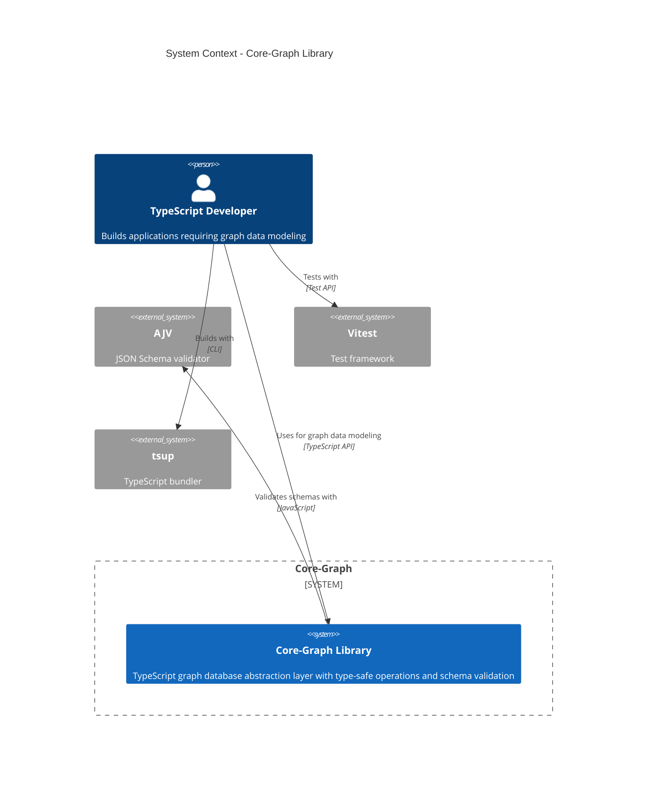
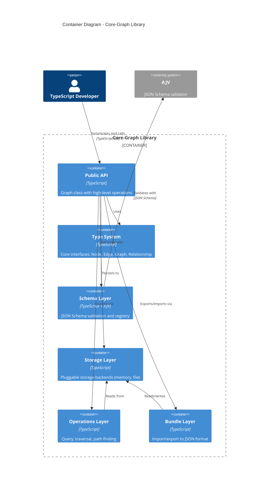
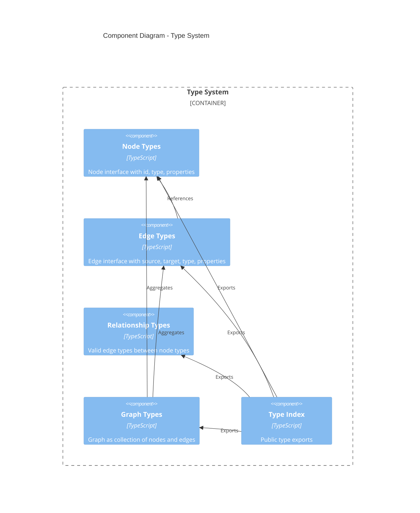
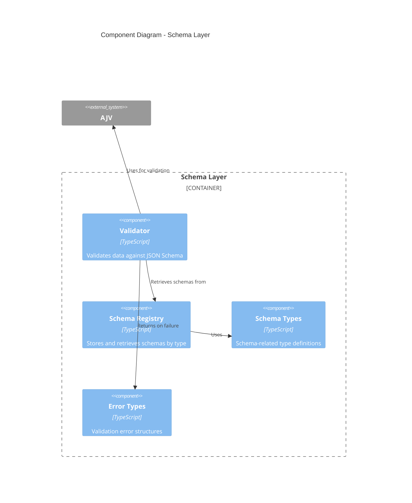
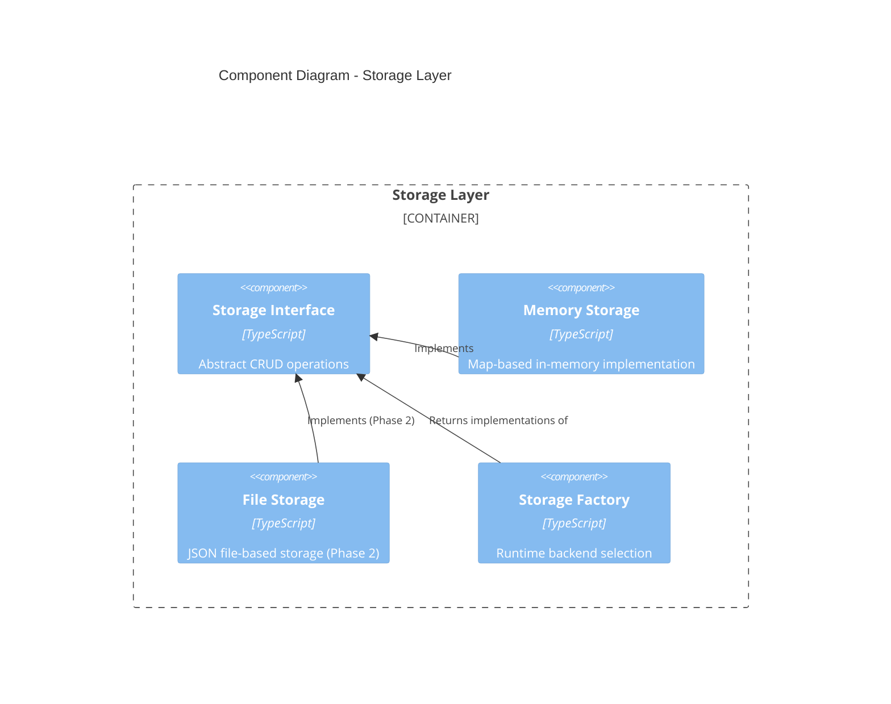
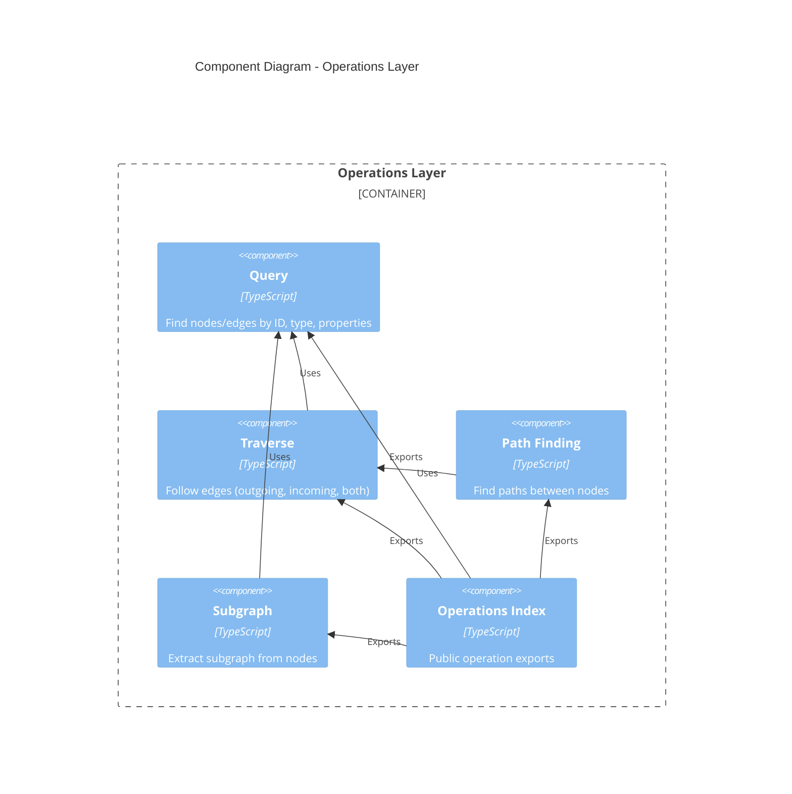
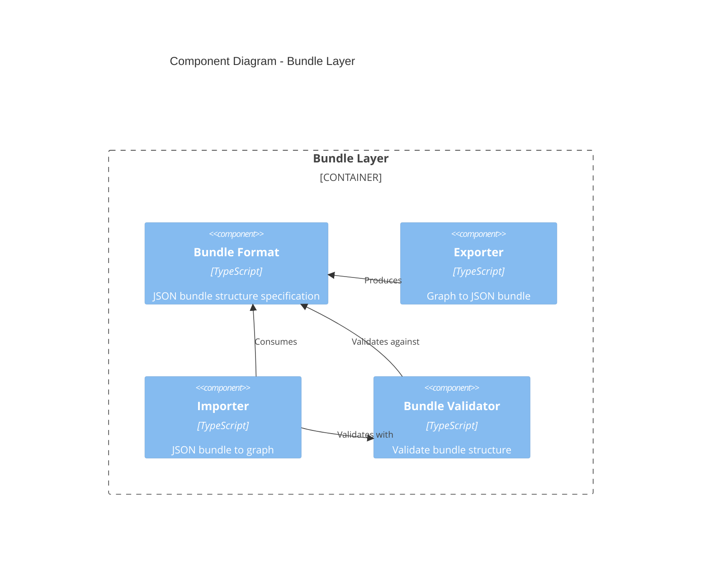
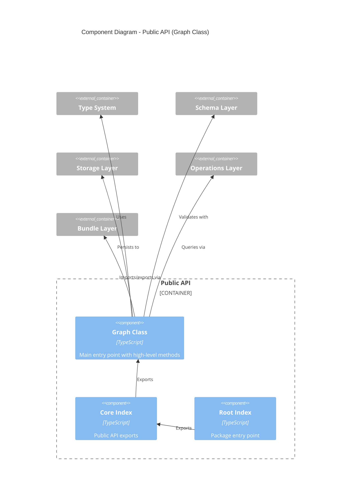

# Architecture Documentation: Core-Graph

> **Status**: Greenfield - Phase 1 Planning
> **Generated**: 2025-12-30
> **Exploration Type**: Quick (specification-based)

## Executive Summary

**Core-Graph** is a planned TypeScript library providing a flexible graph database abstraction layer with type-safe node/edge management, schema validation, and pluggable storage backends.

**Current State**: Phase 1 planning - no implementation yet. This document describes the planned architecture based on `plain-english-spec.md`.

**Architecture Pattern**: Layered architecture with clear separation of concerns
- **Type Layer**: Core data structures and interfaces
- **Validation Layer**: JSON Schema validation
- **Storage Layer**: Pluggable persistence backends
- **Operations Layer**: Query, traversal, and graph algorithms
- **API Layer**: High-level Graph class

## C4 Model

### Level 1: System Context



**System Purpose**: Provide a clean, type-safe API for working with graph data structures (knowledge graphs, relationship networks, dependency graphs) with support for both in-memory and persistent storage.

**Primary Users**: TypeScript/JavaScript developers building applications that model interconnected data

**External Dependencies**:
- **AJV**: JSON Schema validation (runtime validation)
- **Vitest**: Testing framework (development)
- **tsup**: Build tooling (development)

### Level 2: Container Diagram



**Containers Overview**:

| Container | Technology | Responsibility |
|-----------|-----------|----------------|
| **Public API** | TypeScript | Main Graph class, user-facing interface |
| **Type System** | TypeScript | Core data structures and type definitions |
| **Schema Layer** | TypeScript + AJV | JSON Schema validation, registry |
| **Storage Layer** | TypeScript | Abstract storage interface, in-memory and file implementations |
| **Operations Layer** | TypeScript | Query, traversal, path finding algorithms |
| **Bundle Layer** | TypeScript | Serialization/deserialization to JSON |

### Level 3: Component Diagrams

#### Component Diagram: Type System



**Key Types**:
- `Node<T>`: Unique ID, type label, properties of type T
- `Edge<T>`: Source/target node IDs, type label, properties of type T
- `Relationship`: Declares valid edge types between specific node types
- `Graph`: Collection of nodes and edges with metadata

#### Component Diagram: Schema Layer



**Responsibilities**:
- **Validator**: Execute JSON Schema validation using AJV
- **Registry**: Store and lookup schemas by node/edge type
- **Error Types**: Detailed validation failure messages
- **Schema Types**: TypeScript interfaces for schema definitions

#### Component Diagram: Storage Layer



**Storage Interface Operations**:
- `addNode(node)` / `getNode(id)` / `updateNode(id, data)` / `deleteNode(id)`
- `addEdge(edge)` / `getEdge(id)` / `updateEdge(id, data)` / `deleteEdge(id)`
- `findNodes(filter)` / `findEdges(filter)`
- `clear()` / `export()` / `import(data)`

**Phase 1**: Memory storage only
**Phase 2**: File-based storage for persistence

#### Component Diagram: Operations Layer



**Capabilities**:
- **Query**: Find nodes by ID, type, or property filters; find edges by source, target, type
- **Traverse**: Navigate graph following edges (directional or bidirectional)
- **Path Finding**: Discover paths between nodes (Phase 1: basic, Phase 2: Dijkstra, A*)
- **Subgraph**: Extract portions of graph based on criteria
- **Neighbors**: Get adjacent nodes and calculate degree

#### Component Diagram: Bundle Layer



**Bundle Format**:
- JSON structure containing nodes, edges, schemas, metadata
- Version information for compatibility checks
- Support for partial import/export
- Validation before import

#### Component Diagram: Public API (Graph Class)



**Graph Class Responsibilities**:
1. **Construction**: Initialize with storage backend selection
2. **Node Operations**: Add, remove, update nodes
3. **Edge Operations**: Add, remove, update edges
4. **Schema Management**: Register and validate schemas
5. **Querying**: Find nodes/edges, traverse, find paths
6. **Serialization**: Import/export bundles
7. **Events**: (Optional) Emit change notifications

## Technology Stack

### Core Technologies

| Category | Technology | Version | Purpose |
|----------|-----------|---------|---------|
| **Language** | TypeScript | 5.x | Type-safe development |
| **Runtime** | Node.js | 18+ | JavaScript execution |
| **Package Manager** | npm | Latest | Dependency management |
| **Build Tool** | tsup | Latest | TypeScript bundler |
| **Test Framework** | Vitest | Latest | Unit and integration testing |
| **Schema Validation** | AJV | Latest | JSON Schema validation |

### Development Tools

| Tool | Purpose |
|------|---------|
| **ESLint** | Code linting |
| **Prettier** | Code formatting |
| **TypeScript Strict Mode** | Maximum type safety |
| **JSDoc** | API documentation |

### Quality Standards

- **TypeScript**: Strict mode enabled, no `any` in public APIs
- **Test Coverage**: Target ≥ 80%
- **Code Style**: ESLint + Prettier
- **Documentation**: JSDoc for all public APIs

## Project Structure (Planned)

```
core-graph/
├── src/
│   ├── types/                  # SL-TYPES
│   │   ├── Node.ts
│   │   ├── Edge.ts
│   │   ├── Relationship.ts
│   │   ├── Graph.ts
│   │   └── index.ts
│   ├── schema/                 # SL-SCHEMA
│   │   ├── validator.ts
│   │   ├── registry.ts
│   │   ├── types.ts
│   │   ├── errors.ts
│   │   └── index.ts
│   ├── storage/                # SL-STORAGE
│   │   ├── interface.ts
│   │   ├── memory.ts
│   │   ├── file.ts (Phase 2)
│   │   ├── factory.ts
│   │   └── index.ts
│   ├── operations/             # SL-OPS
│   │   ├── query.ts
│   │   ├── traverse.ts
│   │   ├── paths.ts
│   │   ├── subgraph.ts
│   │   └── index.ts
│   ├── bundle/                 # SL-BUNDLE
│   │   ├── format.ts
│   │   ├── exporter.ts
│   │   ├── importer.ts
│   │   ├── validator.ts
│   │   └── index.ts
│   ├── core/                   # SL-CORE
│   │   ├── Graph.ts
│   │   └── index.ts
│   └── index.ts                # Root exports
├── tests/
│   ├── unit/
│   │   ├── types.test.ts
│   │   ├── schema.test.ts
│   │   ├── storage.test.ts
│   │   ├── operations.test.ts
│   │   └── bundle.test.ts
│   └── integration/
│       └── graph.test.ts
├── package.json
├── tsconfig.json
├── vitest.config.ts
├── README.md
└── plain-english-spec.md
```

## Architectural Patterns

### Layered Architecture

The system follows a clean layered architecture with clear dependencies:

```
┌─────────────────────────────────────┐
│         Public API (Graph)          │  User-facing interface
├─────────────────────────────────────┤
│  Operations  │  Bundle  │  Schema   │  Feature layers
├─────────────────────────────────────┤
│         Storage Abstraction         │  Persistence layer
├─────────────────────────────────────┤
│           Type System               │  Core data structures
└─────────────────────────────────────┘
```

**Dependency Flow**: Top layers depend on bottom layers, never reverse

### Strategy Pattern (Storage)

Storage backends implement a common interface, allowing runtime selection:

```typescript
interface Storage {
  addNode(node: Node): void;
  getNode(id: string): Node | null;
  // ... other operations
}

class MemoryStorage implements Storage { /* ... */ }
class FileStorage implements Storage { /* ... */ }
```

**Benefits**: 
- Easy to add new storage backends
- Consistent API across implementations
- Testing with different backends

### Builder Pattern (Graph Construction)

Graph class accepts configuration object for flexible initialization:

```typescript
const graph = new Graph({ 
  storage: 'memory',  // or 'file' in Phase 2
  // future options: validation mode, indexes, etc.
});
```

### Registry Pattern (Schema Management)

Schema registry centralizes schema storage and retrieval:

```typescript
registry.register('Person', personSchema);
const schema = registry.get('Person');
```

### Immutability Where Possible

Operations return new instances rather than mutating:
- Safer concurrent access
- Easier testing
- Predictable behavior

## Design Principles

### 1. Fail Fast

- Validate inputs immediately
- Throw detailed error messages
- Don't allow invalid state

### 2. Progressive Enhancement

- Phase 1: Core functionality
- Phase 2: Advanced features (file storage, advanced algorithms)
- Phase 3+: GraphQL, visualization, distributed graphs

### 3. Separation of Concerns

Each module has a single, well-defined responsibility:
- **Types**: Data structures only
- **Schema**: Validation only
- **Storage**: Persistence only
- **Operations**: Graph algorithms only
- **Bundle**: Serialization only

### 4. Interface-Driven Design

- Define interfaces before implementation
- Program to interfaces, not implementations
- Enables extensibility and testing

### 5. Type Safety

- TypeScript strict mode
- No `any` in public APIs
- Generics for flexible type-safe properties

## Phase 1 Scope (6 Swim Lanes)

### SL-TYPES: Type System
**Deliverables**:
- `types/Node.ts` - Node interface
- `types/Edge.ts` - Edge interface
- `types/Relationship.ts` - Relationship types
- `types/Graph.ts` - Graph type
- Unit tests

**Dependencies**: None

### SL-SCHEMA: Schema Validation
**Deliverables**:
- `schema/validator.ts` - AJV-based validation
- `schema/registry.ts` - Schema storage
- `schema/errors.ts` - Error types
- Unit tests

**Dependencies**: SL-TYPES

### SL-STORAGE: In-Memory Storage
**Deliverables**:
- `storage/interface.ts` - Storage interface
- `storage/memory.ts` - Map-based implementation
- `storage/factory.ts` - Backend selection
- Unit tests

**Dependencies**: SL-TYPES

### SL-OPS: Basic Operations
**Deliverables**:
- `operations/query.ts` - Find nodes/edges
- `operations/traverse.ts` - Graph traversal
- `operations/paths.ts` - Basic path finding
- `operations/subgraph.ts` - Subgraph extraction
- Unit tests

**Dependencies**: SL-TYPES, SL-STORAGE

### SL-BUNDLE: Import/Export
**Deliverables**:
- `bundle/format.ts` - JSON format spec
- `bundle/exporter.ts` - Export logic
- `bundle/importer.ts` - Import logic
- `bundle/validator.ts` - Bundle validation
- Unit tests

**Dependencies**: SL-TYPES, SL-STORAGE, SL-SCHEMA

### SL-CORE: Graph Class
**Deliverables**:
- `core/Graph.ts` - Main API class
- `core/index.ts` - Public exports
- `index.ts` - Root exports
- Integration tests

**Dependencies**: ALL previous swim lanes

## Deferred to Phase 2

The following features are explicitly out of scope for Phase 1:

1. **File-based Storage**: Persistent JSON file backend
2. **Advanced Algorithms**: Dijkstra, A*, PageRank, centrality
3. **Optimization**: Lazy loading, indexing for large graphs
4. **CLI Tooling**: Command-line bundle manipulation
5. **Event System**: Graph change notifications (marked optional in spec)

## Success Criteria

Phase 1 is complete when:

- [ ] All 6 swim lanes implemented
- [ ] All unit tests passing
- [ ] Integration tests for Graph class passing
- [ ] Can create graph, add nodes/edges with validation
- [ ] Can export/import graph as JSON bundle
- [ ] Can query and traverse graph
- [ ] Code coverage ≥ 80%
- [ ] API documentation complete (JSDoc)
- [ ] README with quick start guide

## Example Usage (Planned)

From specification, the intended usage pattern:

```typescript
import { Graph } from 'core-graph';

// Create graph with in-memory storage
const graph = new Graph({ storage: 'memory' });

// Register schemas
graph.registerNodeSchema('Person', {
  type: 'object',
  properties: {
    name: { type: 'string' },
    age: { type: 'number' }
  },
  required: ['name']
});

graph.registerEdgeSchema('KNOWS', {
  type: 'object',
  properties: {
    since: { type: 'string', format: 'date' }
  }
});

// Add nodes (validated against schema)
const alice = graph.addNode({
  type: 'Person',
  properties: { name: 'Alice', age: 30 }
});

const bob = graph.addNode({
  type: 'Person',
  properties: { name: 'Bob', age: 25 }
});

// Add edge (validated against schema)
graph.addEdge({
  type: 'KNOWS',
  source: alice.id,
  target: bob.id,
  properties: { since: '2020-01-15' }
});

// Query
const people = graph.findNodes({ type: 'Person' });
const aliceFriends = graph.neighbors(alice.id, 'outgoing');

// Export to JSON bundle
const bundle = graph.export();
console.log(JSON.stringify(bundle, null, 2));

// Import from bundle
const graph2 = new Graph({ storage: 'memory' });
graph2.import(bundle);
```

## Future Considerations

Beyond Phase 2, the specification notes potential future directions:

1. **GraphQL API Layer**: Query graphs via GraphQL
2. **Visualization Support**: Render graphs in browser/CLI
3. **Graph Database Backends**: Neo4j, ArangoDB, etc.
4. **Distributed Graphs**: Multi-node graph partitioning
5. **ACID Transactions**: Transactional operations

These are noted for architectural awareness but not planned for near-term implementation.

## Technical Debt and Risks

### Current State

No technical debt - greenfield project with no implementation yet.

### Potential Risks

1. **AJV Performance**: JSON Schema validation may be slow for large graphs
   - **Mitigation**: Batch validation, optional validation mode
   
2. **Memory Storage Limitations**: In-memory storage doesn't scale indefinitely
   - **Mitigation**: Phase 2 file storage, eventual database backends
   
3. **Type Complexity**: Generic types for properties may become unwieldy
   - **Mitigation**: Keep property types simple, use `Record<string, any>` if needed
   
4. **Bundle Size**: Large graphs exported as JSON may hit memory limits
   - **Mitigation**: Streaming export/import in Phase 2

### Recommendations for Implementation

1. **Start with SL-TYPES**: Foundation for all other modules
2. **Parallel Development**: SL-SCHEMA and SL-STORAGE can be developed simultaneously after types
3. **Early Integration Testing**: Test Graph class integration as soon as SL-STORAGE is complete
4. **Performance Benchmarks**: Establish baseline performance metrics early
5. **Documentation First**: Write JSDoc before implementation for clarity

## Files Analyzed

This architecture document is based entirely on the project specification:

- `/home/jenner/co/core-graph/plain-english-spec.md` - Complete functional specification
- `/home/jenner/co/core-graph/README.md` - Project overview

**Note**: No implementation code exists yet. This is a greenfield project in Phase 1 planning.

## Completion Report

**Architecture Exploration Complete**

**Explored**:
- Files scanned: 2 (spec and README)
- Modules identified: 6 (matching 6 swim lanes)
- External dependencies: 3 (AJV, Vitest, tsup)

**C4 Model**:
- Context diagram: Created
- Container diagram: Created
- Component diagrams: 6 (one per major container)
- Code diagrams: 0 (not applicable for greenfield)

**Findings**:
- Patterns identified: Layered architecture, Strategy (storage), Registry (schema), Builder (Graph construction)
- Anti-patterns found: 0 (no implementation yet)
- Tech debt items: 0 (greenfield project)

**Output**:
- `/home/jenner/co/core-graph/.claude/architecture/CODEBASE.md` (this file)

**Status**: Ready for Phase 1 roadmap planning and implementation
